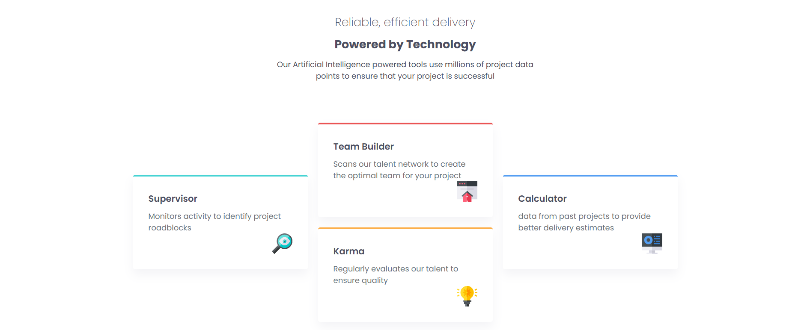

# Frontend Mentor - Four card feature section solution

This is a solution to the [Four card feature section challenge on Frontend Mentor](https://www.frontendmentor.io/challenges/four-card-feature-section-weK1eFYK). Frontend Mentor challenges help you improve your coding skills by building realistic projects.

## Table of contents

- [Overview](#overview)
  - [The challenge](#the-challenge)
  - [Screenshot](#screenshot)
  - [Links](#links)
- [My process](#my-process)
  - [Built with](#built-with)
  - [What I learned](#what-i-learned)
  - [Continued development](#continued-development)
  - [Useful resources](#useful-resources)
- [Author](#author)
- [Acknowledgments](#acknowledgments)

## Overview

### The challenge

Users should be able to:

- View the optimal layout for the site depending on their device's screen size

### Screenshot




### Links

- Solution URL: https://github.com/FrontEndExplorer-Temp/four-card-feature-section

## My process

### Built with

- Semantic HTML5 markup
- CSS Grid
- Flexbox
- Mobile-first workflow
- Google Fonts (Poppins)

### What I learned

While building this project I focused on creating a responsive grid layout that reflows single-column on small screens and a multi-column layout on wider viewports. I also aligned typographic scale and colors with a provided design style guide.

Example code snippets from the project:

```html
<div class="container">
  <div class="cards"> ... </div>
  <!-- more cards -->
</div>
```

```css
.container { 
  display: grid;
  grid-template-columns: 1fr;
}
@media (min-width: 992px) { 
  .container { grid-template-columns: repeat(3, 1fr); }
}
```

### Continued development

- Improve accessibility (contrast checking and semantic landmarks)
- Add unit tests for layout using visual regression if desired

### Useful resources

- [Frontend Mentor](https://www.frontendmentor.io/) - challenge and design assets
- [Google Fonts - Poppins](https://fonts.google.com/specimen/Poppins)

## Author

- Frontend Mentor - [@FrontEndExplorer-Temp](https://www.frontendmentor.io/profile/FrontEndExplorer-Temp)

## Acknowledgments

Thanks to Frontend Mentor for the challenge and design direction.
